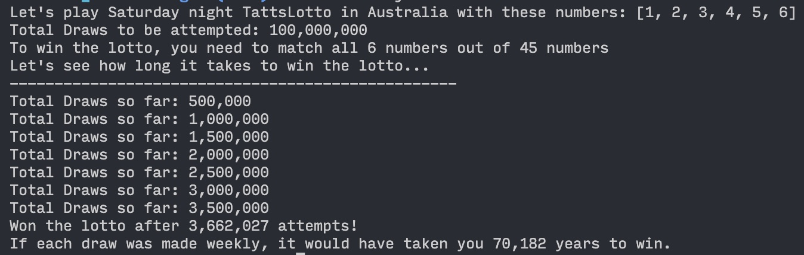

# Lotto Simulator

This is a simple lotto simulator written in JavaScript that simulates a Saturday night Tattslotto draw (Australia) by picking 6 random numbers from 1 to 45. You can choose your own 6 numbers and the simulator will check if all 6 of your numbers match the lotto result. The code will stop early once it gets a win.

> 

---

## How to use

1. Make sure you have Node.js installed on your computer. You can download it from the official website (https://nodejs.org/en/)

2. Create a new file with the extension .js and copy and paste the lotto simulator code into the file.

3. Save the file.

4. Open the command prompt, navigate to the directory where the file is saved, and run the command `node <filename>.js`.

5. The code will be executed and the output will be displayed in the command prompt. The output will show the total matches, total draws, and the percentage of matches.

6. If there is a match, the output will show the number of draws it took to get the first match.

7. You can change the numbers you want to match in the code and re-run the simulation by repeating steps 4 and 5.
